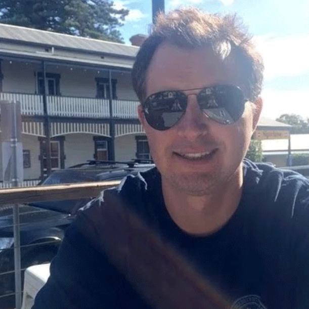
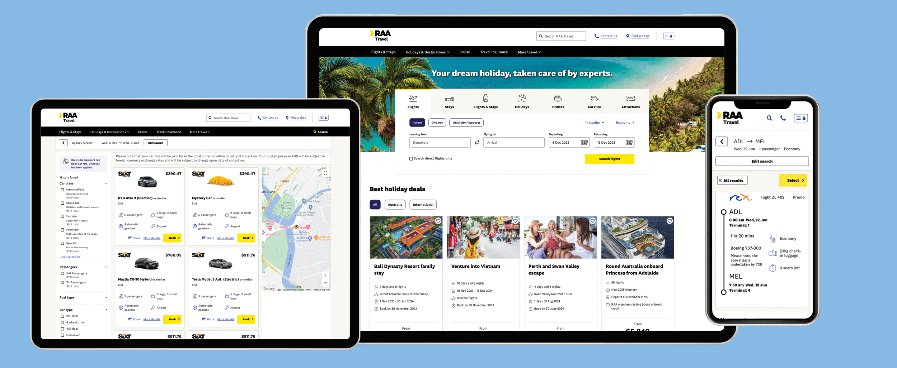
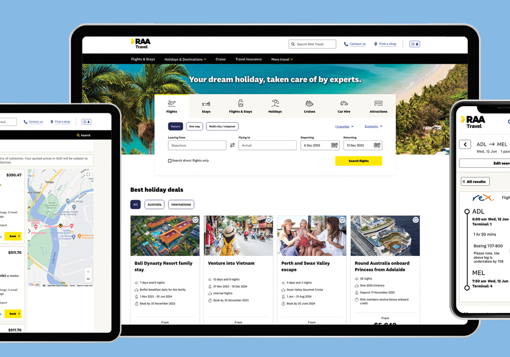
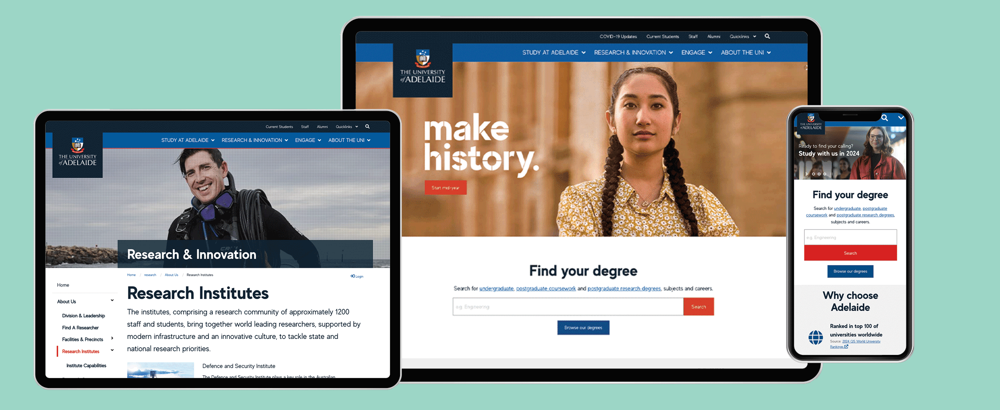
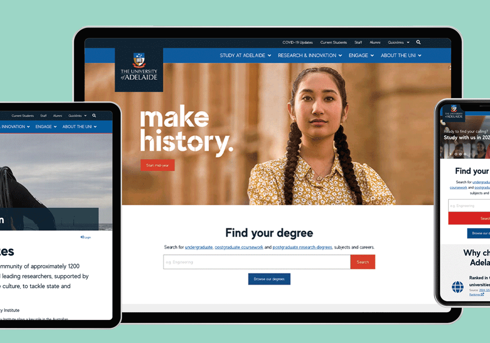

<!-- Header -->
<header>
	

    	

        	

            	

                    <a href="index.html" title="NAME">Andrew Smith</a>
        		

            

            

        		<nav id="menu">
                    <ul id="menu-nav">
                        <li><a href="#work" id="work">view case studies</a></li>
                        <!-- <li><a href="about.html">about</a></li> -->
                        <!-- <li class="hidden-phone"><a href="contact.html" class="btn btn-inverse">contact</a></li>
                        <li class="visible-phone"><a href="contact.html">contact</a></li> -->
                    </ul>
                </nav>
        	

        

    

</header>
<!-- End Header -->

<!-- Start Intro Box -->
<section id="intro-box" class="home margin-0">
	

        

            

                

                    

                        
                    

                    

                        <h3>Hi, I'm Andrew. I'm a UX & UI designer and Front End web developer based in Adelaide, South Australia.</h3>
                        
Feel free to connect with me via email or linkedin.

                        <ul class="inline text-left">
                            <li><a href="mai&#108;t&#111;&#58;%6&#49;&#115;&#37;6Di%74hd%69&#103;i%74al&#64;gm&#97;%&#54;9&#108;&#46;com"target="_blank"><svg xmlns="http://www.w3.org/2000/svg" viewBox="0 0 128 96" width="30" height="30" id="email"><g data-name="Layer 2"><path d="M0 11.283V8a8 8 0 0 1 8-8h112a8 8 0 0 1 8 8v3.283l-64 40zm66.12 48.11a4.004 4.004 0 0 1-4.24 0L0 20.717V88a8 8 0 0 0 8 8h112a8 8 0 0 0 8-8V20.717z"></path></g></svg></a>
                            </li>
                            <li><a href="https://www.linkedin.com/in/andrewstephensmith/" target="_blank" class="social"><svg xmlns="http://www.w3.org/2000/svg" x="0px" y="0px" width="30" height="30" viewBox="0 0 50 50"><path d="M41,4H9C6.24,4,4,6.24,4,9v32c0,2.76,2.24,5,5,5h32c2.76,0,5-2.24,5-5V9C46,6.24,43.76,4,41,4z M17,20v19h-6V20H17z M11,14.47c0-1.4,1.2-2.47,3-2.47s2.93,1.07,3,2.47c0,1.4-1.12,2.53-3,2.53C12.2,17,11,15.87,11,14.47z M39,39h-6c0,0,0-9.26,0-10 c0-2-1-4-3.5-4.04h-0.08C27,24.96,26,27.02,26,29c0,0.91,0,10,0,10h-6V20h6v2.56c0,0,1.93-2.56,5.81-2.56 c3.97,0,7.19,2.73,7.19,8.26V39z"></path></svg></a>
                            </li>
                        </ul>
                    

                

            
 
        

    

</section>
<!-- End Intro Box -->

<!-- Start Section Portfolio Projects -->
<section id="portfolio" class="margin-100 portfolio">
    

        

            <ul id="projects" class="portfolio-gallery">
                <li class="item-project no-icon home span12">
                    <a href="raa.html">
                        
                        
                    </a>
                </li>       
            </ul>
        

    

    

        

            <h2>RAA</h2>
            
This case study includes web and mobile application design for RAA Travel, RAA mobile app, and RAA identity management.

            <a href="raa.html" class="btn btn-inverse">view case study</a>
        

    

</section>
<!-- End Section Portfolio Projects -->

<!-- Start Section Portfolio Projects -->
<section id="" class="margin-100 portfolio">
    

        

            <ul id="projects">
                <li class="item-project no-icon home span12">
                    <a href="uofa.html">
                        
                        
                    </a>
                </li>   
            </ul>
        

    

    

        

            <h2>University of Adelaide</h2>
            
This case study includes design and development for the University of Adelaide website rebuild project, and style guide application.

            <a href="uofa.html" class="btn btn-inverse">view case study</a>
        

    

</section>
<!-- End Section Portfolio Projects -->

<!-- content-container -->
